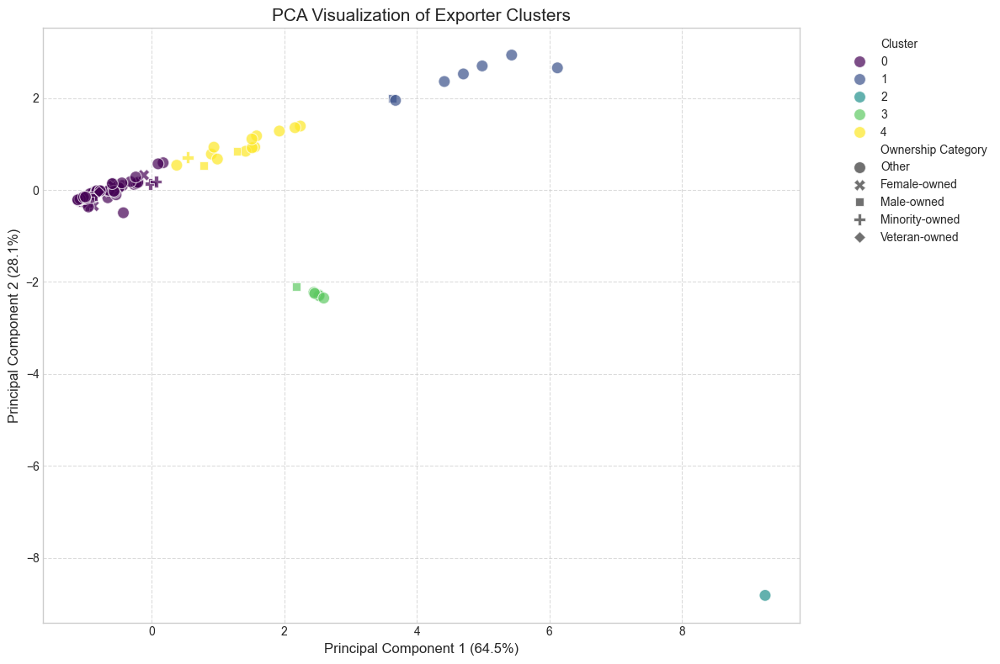

# Strategic Export Analytics: Machine Learning and Business Intelligence for U.S. SMEs

[](https://www.python.org/downloads/)
[](https://pandas.pydata.org/)
[](https://scikit-learn.org/)
[](https://jupyter.org/)

---

## 🚀 Key Technical Concepts

This project demonstrates advanced technical modeling with real-world policy impact, including:
- **Stratified export status segmentation** to capture diverse business behaviors
- **Correlation analysis** of financial metrics vs export performance
- **Export ratio computation** to assess trade intensity across firm types
- **K-Means clustering** to identify actionable exporter archetypes
- **Ownership-based slicing** (gender, minority, veteran) for equity-aware analysis
- **Data anomaly recognition** using statistical outlier detection

## Sample plot

---

## 📁 Project Structure

```bash
├── notebook.ipynb # Exploratory analysis and modeling
├── data/           # Original datasets               
├── images/         # Cluster visualization exports
├── models/         # models
├── README.md
├── requirements.txt
```


## 📊 Data Source

**Origin**: Proprietary survey of U.S. Small Businesses (2022)

- **Public Dataset**: [U.S. Census Bureau Business Dynamics Statistics (BDS)](https://www.census.gov/data/tables/time-series/econ/bds/bds-tables.html)
- Cleaned for consistency in ownership categories and revenue metrics
- Export status inferred from transactional and response data
- Segmentation informed by real trade behavior and reported receipts


---

## Small Business Exporter Analysis - Key Findings

### 1. Exporting Status
32.7% of firms are exporters, 33.9% are non-exporters, and 33.4% have mixed export status.
**Implication**: Nearly one-third of small businesses engage in exporting, presenting opportunities for growth through trade support programs.

### 2. Business Size & Exporting
**Exporters:**
- 59.7% are "Very Small" (receipts < $1M)
- 18.2% have receipts between $1M–$50M

**Non-Exporters:**
- 35.7% are "Very Small"
- 32.7% are "Very Large"

**Implication**: Small businesses are more likely to export, while larger firms may need incentives to expand internationally.

### 3. Export-Revenue Relationship
- Strong correlation (0.998) between total receipts and export volume
- Average export ratio: 5.2% (exports as % of receipts)
- Female-owned firms have higher export ratios (8.9%) than male-owned firms (6.1%)

**Implication**: Female- and minority-owned businesses show strong export potential relative to their size.

### 4. Small Exporter Subset (Bottom 75%)
- 62.2% of exporters are small (receipts < $12.9M)
- Ownership breakdown:
  - 78.3% "Other"
  - 5.8% each for female-, male-, minority-, and veteran-owned firms

**Implication**: Small exporters dominate, but underrepresented groups (e.g., veteran-owned) may need targeted support.

### 5. Exporter Clusters (K-Means Results)
- Cluster 0 (75.8%): High export intensity (74,878% ratio)
- Cluster 1 (5.8%): Large receipts ($8.4M), moderate export ratio (61%)
- Cluster 3 (5.0%): Large employers (61,376 employees), high exports ($5.8M)
- Cluster 4 (12.5%): Mid-sized firms ($1.8M receipts), 254% export ratio

**Implication**: Policies should differentiate between high-intensity exporters, large employers, and general exporters.

### 6. Policy Recommendations
- Small exporters: Prioritize trade education and logistics support
- Female/minority-owned firms: Offer grants for market entry
- Large employers: Link export incentives to job creation
- Outliers: Investigate extreme export ratios for data accuracy

---

## 📌 Conclusion

This analysis identifies key segments of U.S. small exporters, revealing opportunities for targeted support. Small and diverse-owned businesses show strong export potential, while larger firms may benefit from export-linked job growth incentives. Data-driven strategies can maximize the impact of trade policies.

> This project showcases the fusion of technical modeling and economic insight — built to empower decision-makers with clarity, precision, and impact.

---


## 🔧 Installation & Setup

```bash
# Recommended Python Version
python>=3.9

# Create and activate virtual environment
python -m venv venv
source venv/bin/activate  # On Windows: venv\Scripts\activate

# Install dependencies
pip install -r requirements.txt
```

### requirements.txt
```
pandas>=1.5
scikit-learn>=1.1
jupyterlab
matplotlib
seaborn
```